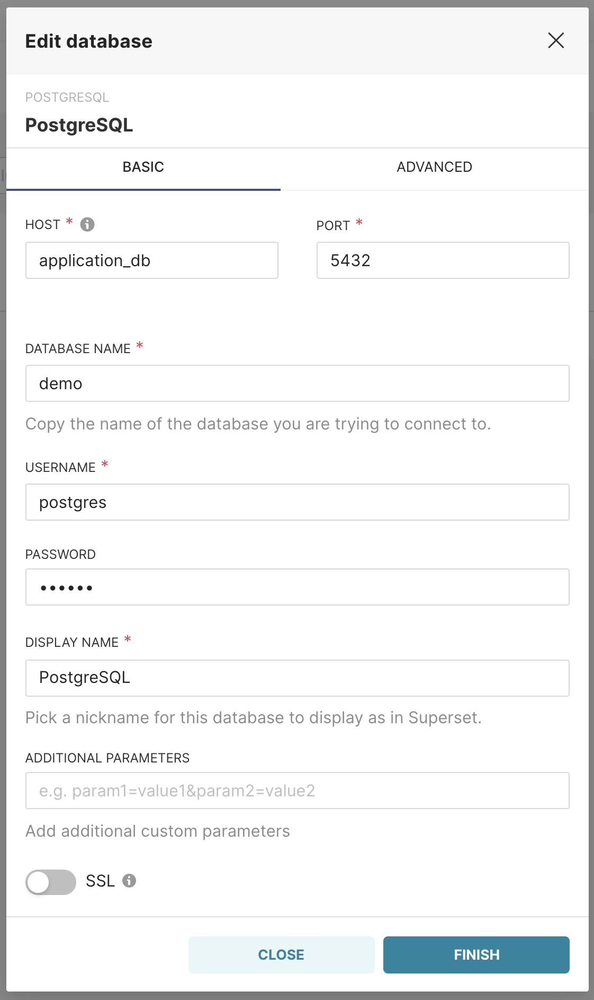
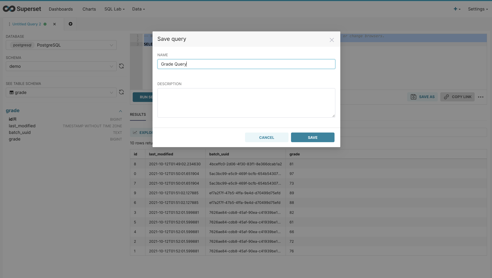
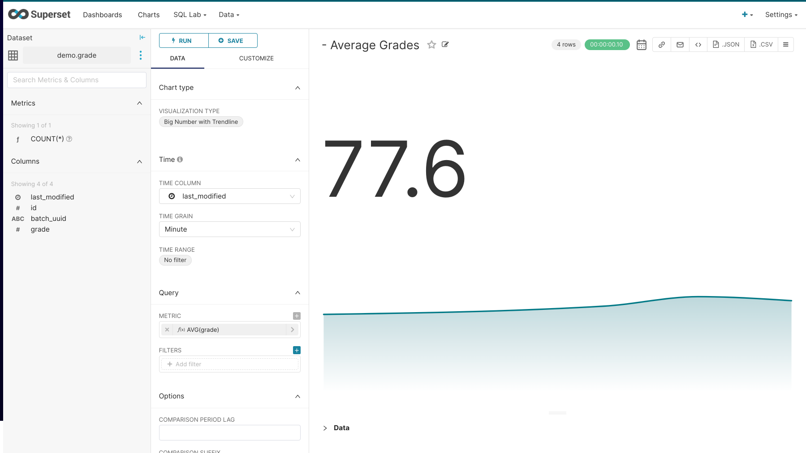
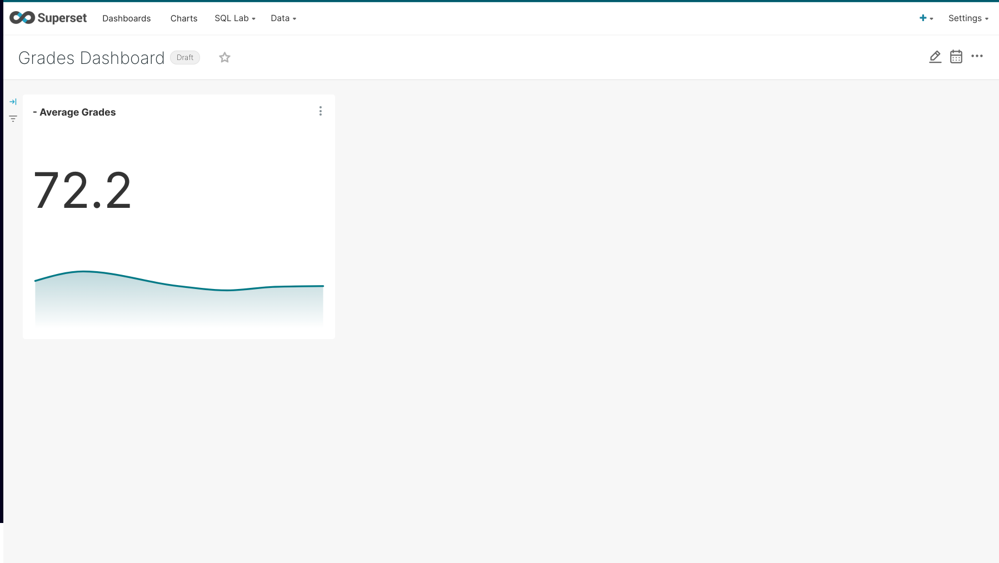

# demo-merge-pipeline

A template mysql database for local deveploment.

## Superset Dashboards

url: http://localhost:8088/
username: admin
pasword: admin

## Local Database Credentials

host: localhost
port: 5433/5432 (docker external)/(docker internal)
username: postgres
password; docker

## Dashboard Setup

1) Create a Data Source for the database.
2) Create a Dataset via a Saved Query.
3) Create a Chart using the Dataset.
4) Adding the Chart to Dashboard

# References

- https://hub.docker.com/_/mysql